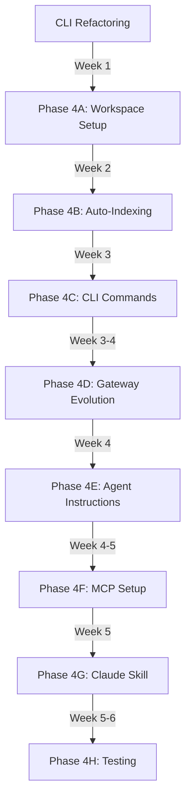

# Phase 4: Legilimens Integration Plan

**Status:** Planning Complete - Awaiting Implementation
**Date:** October 29, 2025
**Duration Estimate:** Integration only: 5-6 weeks (assumes CLI refactoring complete)

---

## Table of Contents

- [Overview](#overview)
- [Integration Architecture](#integration-architecture)
- [Prerequisites](#prerequisites)
- [Phase Breakdown](#phase-breakdown)
- [Timeline & Critical Path](#timeline--critical-path)
- [Success Criteria](#success-criteria)
- [Risk Assessment](#risk-assessment)

---

## Overview

### Current State

GraphRAG is a **standalone TypeScript project** with Phase 3 complete:
- ✅ Entity and edge embedding generation
- ✅ Repository indexing pipeline
- ✅ 4-way hybrid search (semantic + sparse + pattern + graph)
- ✅ MCP server for Claude Desktop
- ✅ 100% offline-first with sqlite-vec
- ✅ 69 tests (90% pass rate)

### Integration Target

**Legilimens CLI** - Documentation generation tool for external dependencies
- **Location:** `/Users/bbrenner/Documents/Scripting Projects/doc-gateway-cli`
- **Structure:** TypeScript monorepo (pnpm workspaces)
- **Current Role:** Fetches docs, generates gateway files, points to external MCP tools

### Integration Vision

Transform Legilimens from external-dependency to local-first:

**Before Integration:**
```
User → Legilimens → Fetches docs → Gateway file points to DeepWiki (external)
```

**After Integration:**
```
User → Legilimens → Fetches docs → Auto-indexes to GraphRAG (local)
                  ↓
Gateway file points to local GraphRAG MCP tool → Instant surgical queries
```

**Key Benefits:**
- 🏠 **Local-First:** All knowledge stored locally, no external API calls
- ⚡ **Instant Updates:** Re-indexing updates knowledge immediately
- 📝 **Team Annotations:** Add team-specific notes to documentation
- 🔗 **Cross-Repository:** Discover connections across dependencies
- 🎯 **Surgical Precision:** Same query quality as DeepWiki but 100% offline

---

## Integration Architecture

### Monorepo Structure

```
doc-gateway-cli/
├── packages/
│   ├── core/              (existing - @legilimens/core)
│   ├── cli/               (existing - @legilimens/cli)
│   ├── harness-service/   (existing)
│   └── graphrag/          (NEW - @legilimens/graphrag)
│       ├── src/
│       │   ├── index.ts   (Public API exports)
│       │   ├── lib/       (GraphRAG core from this repo)
│       │   ├── mcp/       (MCP server from this repo)
│       │   ├── providers/ (AI provider abstraction)
│       │   ├── utils/
│       │   └── types/
│       ├── package.json
│       └── README.md
├── pnpm-workspace.yaml    (add "packages/graphrag")
└── tsconfig.base.json     (shared config)
```

### Core Workflow

```
1. User: legilimens generate vercel/ai
   ↓
2. Fetch documentation (RefTools/Context7/Firecrawl)
   ↓
3. Generate gateway file + static docs
   ↓
4. AUTO-INDEX to GraphRAG:
   - Extract entities (Triplex)
   - Generate embeddings (Granite Embedding 125M)
   - Build graph (nodes + edges)
   ↓
5. Gateway file updated:
   "Use local MCP tool: legilimens-graphrag"
   ↓
6. Agent queries via MCP → Local GraphRAG → Results
```

### AI Model Stack

**Gateway Generation (Legilimens):**
- **Granite 4 Micro** (local, default) - 2-3GB, 128K context
- **Fallback:** OpenRouter (200+ models)

**Embedding & Indexing (GraphRAG):**
- **Granite Embedding 125M** - Entity/edge embeddings (768D)
- **SciPhi/Triplex** - Knowledge graph triple extraction
- **Optional: StructLM-7B** - Advanced graph reasoning

**Query Analysis (MCP Server):**
- **Granite 4 Micro** - Query classification for hybrid search
- **Optional: Escalation** - Complex queries via OpenRouter

### Database Location

**Single centralized database:** `~/.legilimens/graph.db`

**Multi-repository support via namespacing:**
```
~/.legilimens/graph.db
├── Repository: "vercel/ai"
├── Repository: "lodash"
├── Repository: "my-local-project"
└── Repository: "company-internal"
```

---

## Prerequisites

### CLI Refactoring (Must Complete First)

**Estimate:** 1-2 weeks

**Required Changes:**

1. **UX Modernization:**
   - Convert ENV variables to CLI flags (`--debug`, `--minimal`)
   - Update terminology: "Generate Gateway" → "Generate Documentation"
   - Maintain ENV support as backup for programmatic use

2. **Multi-Model Support:**
   - Add model selection during setup:
     - **Granite 4 Micro** (NEW DEFAULT) - 2-3GB, 128K context, 59.98% BFCL
     - **Phi-4** (Legacy) - 6-8GB, 16K context
     - **Qwen 2.5 1.5B** (Lightweight) - 1-1.5GB, 32K context
   - Add `legilimens uninstall-model` command
   - Review duplicate install prevention

3. **Non-Interactive Mode:**
   ```bash
   legilimens generate vercel/ai --non-interactive --output ./docs
   legilimens setup --non-interactive --model granite-4-micro
   ```

4. **Agent Instructions:**
   - Generate `.claude/CLAUDE.md` (Claude Code)
   - Generate `AGENTS.md` (General agents)
   - Generate `.cursorrules` (Cursor)
   - Auto-update as features evolve

5. **Claude Skill:**
   - Create Claude skill for Legilimens
   - Distribute with project

**Status:** Defined in `/Users/bbrenner/Documents/Scripting Projects/doc-gateway-cli/docs/templates/Refactor and Enhancements.md`

---

## Phase Breakdown

### Phase 4A: GraphRAG Workspace Setup

**Duration:** Week 1 (8-12 hours)

**Objective:** Integrate GraphRAG as monorepo workspace package

**Tasks:**

1. **Copy GraphRAG Source**
   - Copy `/Users/bbrenner/Documents/Scripting Projects/graphrag-with-sqlite_vec/src/` to `packages/graphrag/src/`
   - Copy test files to `packages/graphrag/tests/`
   - Copy documentation to `packages/graphrag/docs/`

2. **Update Build Configuration**
   - Create `packages/graphrag/package.json`
   - Create `packages/graphrag/tsconfig.json` (extends base)
   - Update `pnpm-workspace.yaml`: add `"packages/graphrag"`
   - Update `tsconfig.base.json`: add path mapping

3. **Update Imports**
   - Change all imports from `./` to relative paths within package
   - Update environment variable prefix: `DB_PATH` → `GRAPHRAG_DB_PATH`
   - Ensure `.js` extensions on all imports (ESM requirement)

4. **Add OpenRouter Provider**
   - Create `packages/graphrag/src/providers/openrouter.ts`
   - Update `packages/graphrag/src/providers/config.ts` to support OpenRouter
   - Add OpenRouter to factory pattern

5. **Test Standalone Build**
   ```bash
   pnpm --filter @legilimens/graphrag build
   pnpm --filter @legilimens/graphrag test
   pnpm --filter @legilimens/graphrag mcp:dev
   ```

**Files Created:**
- `packages/graphrag/package.json`
- `packages/graphrag/tsconfig.json`
- `packages/graphrag/README.md`
- `packages/graphrag/src/providers/openrouter.ts`

**Files Modified:**
- `pnpm-workspace.yaml`
- `tsconfig.base.json`
- `packages/graphrag/src/providers/config.ts`
- `packages/graphrag/src/providers/factory.ts`

**Success Criteria:**
- ✅ GraphRAG compiles in monorepo
- ✅ All tests pass
- ✅ MCP server starts successfully
- ✅ Can index test repository
- ✅ Can query via MCP
- ✅ OpenRouter provider works

**Dependencies:** CLI refactoring complete

---

### Phase 4B: Automatic Indexing Pipeline

**Duration:** Week 2 (12-16 hours)

**Objective:** Auto-index documentation during generation workflow

**Architecture:**

```typescript
// packages/core/src/gateway.ts - Enhanced workflow

async function generateDocumentation(target: string) {
  // 1. Fetch documentation (existing)
  const docs = await fetchDocumentation(target);

  // 2. Generate gateway file (existing)
  const gateway = await generateGateway(docs);

  // 3. Save static documentation (existing)
  await saveStaticDocs(docs, './docs');

  // 4. NEW: Index to GraphRAG automatically
  if (config.graphrag.enabled) {
    const indexer = new GraphRAGIndexer({
      dbPath: config.graphrag.dbPath,
      model: config.model
    });

    await indexer.index({
      repositoryId: target,
      sourcePath: './docs',
      onProgress: (progress) => {
        console.log(`Indexing: ${progress.phase} (${progress.percent}%)`);
      }
    });

    console.log('✓ Documentation indexed to local GraphRAG');
    console.log(`  Entities: ${indexer.stats.entities}`);
    console.log(`  Edges: ${indexer.stats.edges}`);
    console.log(`  Embeddings: ${indexer.stats.embeddings}`);
  }

  // 5. Gateway file now references local GraphRAG
  gateway.mcpGuidance = buildGraphRAGGuidance({
    target,
    indexed: config.graphrag.enabled
  });

  return { gateway, docs, indexed: config.graphrag.enabled };
}
```

**Tasks:**

1. **Create GraphRAG Wrapper**
   - Create `packages/core/src/graphrag/indexer.ts`
   - Wrap `@legilimens/graphrag` RepositoryIndexer
   - Add progress callbacks for UI
   - Handle errors gracefully

2. **Update Gateway Generation**
   - Modify `packages/core/src/gateway.ts`
   - Hook indexing into generation workflow
   - Add progress indicators
   - Handle `--skip-index` flag

3. **Configuration Management**
   - Add GraphRAG section to `~/.legilimens/config.json`
   - Enable/disable auto-indexing
   - Configure database path
   - Configure model selection

4. **Error Handling**
   - Continue if indexing fails (don't block doc generation)
   - Log errors clearly
   - Suggest fixes (missing model, disk space, etc.)

**Files Created:**
- `packages/core/src/graphrag/indexer.ts`
- `packages/core/src/graphrag/config.ts`

**Files Modified:**
- `packages/core/src/gateway.ts`
- `packages/core/src/config.ts`
- `packages/core/package.json` (add `@legilimens/graphrag` dependency)

**Success Criteria:**
- ✅ `legilimens generate vercel/ai` automatically indexes
- ✅ Progress shown during indexing
- ✅ Gateway file references local GraphRAG
- ✅ Can skip indexing with `--skip-index`
- ✅ Errors don't block doc generation

**Dependencies:** Phase 4A complete

---

### Phase 4C: CLI Commands for GraphRAG

**Duration:** Week 3 (12-16 hours)

**Objective:** Add GraphRAG management commands to CLI

**New Commands:**

```bash
# Index existing documentation
legilimens index vercel/ai --source ./docs/vercel-ai

# Query knowledge base
legilimens query "How do I stream responses?" --repos vercel/ai

# List indexed repositories
legilimens list-indexed

# Remove from index
legilimens unindex vercel/ai

# GraphRAG statistics
legilimens graph-stats

# Re-index (update embeddings)
legilimens reindex vercel/ai
```

**Command Specifications:**

1. **`index` Command**
   ```typescript
   interface IndexOptions {
     repository: string;      // GitHub repo, NPM package, or local path
     source?: string;         // Source directory (if already downloaded)
     id?: string;            // Custom repository ID
     embeddings?: boolean;   // Generate embeddings (default: true)
     update?: boolean;       // Update existing index
   }
   ```

2. **`query` Command**
   ```typescript
   interface QueryOptions {
     query: string;
     repos?: string[];       // Filter by repository IDs
     maxResults?: number;    // Limit results (default: 10)
     strategy?: 'hybrid' | 'semantic' | 'sparse' | 'graph';
     format?: 'text' | 'json';
   }
   ```

3. **`list-indexed` Command**
   - Display table of indexed repositories
   - Show: ID, Name, Entities, Edges, Embeddings, Last Indexed
   - Sort by date (most recent first)

4. **`unindex` Command**
   - Remove repository from knowledge base
   - Confirmation prompt (unless `--force`)
   - Delete nodes, edges, chunks, embeddings

5. **`graph-stats` Command**
   - Show database statistics
   - Total entities, edges, embeddings
   - Storage size
   - Query performance metrics

**Tasks:**

1. **Implement Commands**
   - Create `packages/cli/src/commands/index.ts`
   - Create `packages/cli/src/commands/query.ts`
   - Create `packages/cli/src/commands/list-indexed.ts`
   - Create `packages/cli/src/commands/unindex.ts`
   - Create `packages/cli/src/commands/graph-stats.ts`
   - Create `packages/cli/src/commands/reindex.ts`

2. **Update Main Menu**
   - Modify `packages/cli/src/clackApp.ts`
   - Add GraphRAG section to menu
   - Group related commands

3. **Non-Interactive Support**
   - All commands work with flags
   - Parseable JSON output (optional)
   - Exit codes for scripting

4. **Rich Terminal Output**
   - Use `@clack/prompts` for interactive prompts
   - Tables for list views
   - Progress bars for indexing
   - Color-coded output

**Files Created:**
- `packages/cli/src/commands/index.ts` (~200 lines)
- `packages/cli/src/commands/query.ts` (~150 lines)
- `packages/cli/src/commands/list-indexed.ts` (~100 lines)
- `packages/cli/src/commands/unindex.ts` (~80 lines)
- `packages/cli/src/commands/graph-stats.ts` (~120 lines)
- `packages/cli/src/commands/reindex.ts` (~100 lines)

**Files Modified:**
- `packages/cli/src/clackApp.ts` (~50 lines modified)
- `packages/cli/package.json` (add scripts)

**Success Criteria:**
- ✅ All commands work in interactive mode
- ✅ All commands work in non-interactive mode
- ✅ Terminal output is clear and informative
- ✅ Commands documented in `--help`
- ✅ JSON output available for scripting

**Dependencies:** Phase 4B complete

---

### Phase 4D: Gateway File Evolution

**Duration:** Week 3-4 (8-12 hours)

**Objective:** Update gateway files to leverage local GraphRAG

**Current Template:**
```markdown
## MCP Tool Guidance
USE DEEPWIKI MCP TO ACCESS DEPENDENCY KNOWLEDGE!
Repository: vercel/ai
Example: ask_question("What is the quickest way to integrate this dependency?")
```

**New Template:**
```markdown
## Documentation Access

### 🏠 Local GraphRAG (Recommended)
This dependency is indexed in your local knowledge base.

**Via CLI:**
```bash
legilimens query "streaming responses" --repos vercel/ai
legilimens query "What is StreamingTextResponse?"
```

**Via MCP (Claude Desktop):**
Use the `legilimens-graphrag` MCP server to query this documentation.

**Intelligent Query Examples:**
- Conceptual: "How do I implement streaming in React?"
- Identifier: "Find StreamingTextResponse class"
- Relationship: "What uses the useChat hook?"
- Pattern: "Show examples with error handling"

### 📄 Static Documentation
Full offline reference: `./docs/vercel-ai/README.md`

### 🌐 External Alternative (Fallback)
If local GraphRAG unavailable:
- **DeepWiki MCP:** Repository `vercel/ai`
- **Online Docs:** https://sdk.vercel.ai/docs
```

**Tasks:**

1. **Update Template Files**
   - Modify `packages/core/src/templates/legilimens-template.md`
   - Create template variants for indexed/unindexed

2. **Update Gateway Generator**
   - Modify `buildMcpGuidance()` in `packages/core/src/gateway.ts`
   - Check if repository is indexed
   - Provide contextual examples
   - Include fallback instructions

3. **Repository-Specific Examples**
   - Generate 3-5 example queries per dependency
   - Use LLM to analyze documentation and suggest queries
   - Include examples in gateway file

4. **Status Indicators**
   - Show indexing status in gateway file
   - Include entity/edge counts
   - Show last indexed timestamp

**Files Modified:**
- `packages/core/src/templates/legilimens-template.md`
- `packages/core/src/gateway.ts` (~100 lines modified)

**Success Criteria:**
- ✅ Gateway files prioritize local GraphRAG
- ✅ Clear instructions for CLI and MCP usage
- ✅ Contextual example queries
- ✅ Fallback options if GraphRAG unavailable
- ✅ Status indicators (indexed, entity count, etc.)

**Dependencies:** Phase 4C complete

---

### Phase 4E: Agent Instructions Integration

**Duration:** Week 4 (6-8 hours)

**Objective:** Auto-generate agent instruction files

**New Command:**
```bash
legilimens setup-agent claude-code
legilimens setup-agent cursor
legilimens setup-agent all
```

**Generated Files:**

**`.claude/CLAUDE.md` (Claude Code):**
```markdown
# Project Documentation

## Legilimens Document Management

This project uses Legilimens for dependency documentation management.

**Documentation Location:** `./docs/`

**Local GraphRAG Knowledge Base:**
- Database: `~/.legilimens/graph.db`
- Indexed dependencies available via MCP

**Critical Workflow:**
1. **ALWAYS check documentation before implementing dependencies**
2. **Query local knowledge base:**
   ```bash
   legilimens query "your question" --repos vercel/ai
   ```
3. **Use MCP tool when available:** `legilimens-graphrag`

**Indexed Dependencies:**
| Repository | Entities | Edges | Last Indexed |
|-----------|----------|-------|--------------|
| vercel/ai | 245 | 412 | 2025-10-29 |
| lodash | 189 | 301 | 2025-10-28 |
| react | 342 | 578 | 2025-10-27 |

**Legilimens Commands:**
- `legilimens generate <dependency>` - Fetch and index new documentation
- `legilimens query <question>` - Query knowledge base
- `legilimens list-indexed` - Show all indexed dependencies
- `legilimens graph-stats` - Show database statistics

**Documentation Standards:**
- Always reference official docs via Legilimens
- Don't implement from memory if dependency is indexed
- Query for examples and best practices
- Check for breaking changes and migration guides
```

**AGENTS.md (General Agents):**
```markdown
# Agent Instructions

## Documentation Access

This project uses Legilimens for centralized dependency documentation management with local GraphRAG knowledge base.

### For All Agents

**Before implementing any dependency:**
1. Check if documentation is indexed: `legilimens list-indexed`
2. Query for implementation details: `legilimens query "your question"`
3. Reference static docs if needed: `./docs/<dependency>/`

### MCP-Compatible Agents

Use the `legilimens-graphrag` MCP server for real-time documentation queries:
- Semantic search for concepts
- Exact identifier lookup
- Relationship discovery
- Pattern matching

### Indexed Dependencies

<!-- AUTO-GENERATED - DO NOT EDIT MANUALLY -->
- vercel/ai (245 entities, 412 edges, indexed 2025-10-29)
- lodash (189 entities, 301 edges, indexed 2025-10-28)
- react (342 entities, 578 edges, indexed 2025-10-27)
```

**Tasks:**

1. **Create Template Generator**
   - Create `packages/cli/src/generators/agent-instructions.ts`
   - Template for each agent type (Claude, Cursor, Gemini, etc.)
   - Dynamic content insertion (indexed dependencies, stats)

2. **Implement `setup-agent` Command**
   - Create `packages/cli/src/commands/setup-agent.ts`
   - Detect agent type and config location
   - Generate appropriate instruction file
   - Support multiple agents (`--all` flag)

3. **Auto-Update System**
   - Update instruction files when dependencies added/removed
   - Hook into `generate` and `unindex` commands
   - Preserve custom modifications (use markers)

4. **Support Multiple Agent Types**
   - Claude Code (`.claude/CLAUDE.md`)
   - Cursor (`.cursorrules`)
   - Gemini (`Gemini.md`)
   - Warp (`warp.md`)
   - Generic (`AGENTS.md`)

**Files Created:**
- `packages/cli/src/generators/agent-instructions.ts` (~200 lines)
- `packages/cli/src/commands/setup-agent.ts` (~150 lines)
- `packages/cli/src/templates/claude-instructions.md`
- `packages/cli/src/templates/cursor-instructions.md`
- `packages/cli/src/templates/agents-instructions.md`

**Files Modified:**
- `packages/cli/src/clackApp.ts` (add to menu)
- `packages/core/src/gateway.ts` (hook auto-update)

**Success Criteria:**
- ✅ Agent instruction files generated automatically
- ✅ Files updated when dependencies change
- ✅ Clear instructions for accessing documentation
- ✅ Supports Claude Code, Cursor, Gemini, etc.
- ✅ Preserves custom modifications

**Dependencies:** Phase 4D complete

---

### Phase 4F: MCP Server Configuration

**Duration:** Week 4-5 (6-8 hours)

**Objective:** Seamless MCP server setup for Claude Desktop

**Auto-Configuration Command:**
```bash
legilimens setup-mcp
```

**What It Does:**
1. Detects Claude Desktop config location
2. Adds `legilimens-graphrag` to `claude_desktop_config.json`
3. Configures database path: `~/.legilimens/graph.db`
4. Sets up Granite 4 Micro for query analysis
5. Provides startup instructions
6. Verifies configuration

**Target Configuration:**
```json
{
  "mcpServers": {
    "legilimens-graphrag": {
      "command": "node",
      "args": [
        "/absolute/path/to/doc-gateway-cli/packages/graphrag/dist/mcp/server.js"
      ],
      "env": {
        "GRAPHRAG_DB_PATH": "/Users/username/.legilimens/graph.db",
        "AI_PROVIDER": "llamacpp",
        "LLAMACPP_MODEL_PATH": "/Users/username/.legilimens/models/granite-4-micro.gguf"
      }
    }
  }
}
```

**Tasks:**

1. **Create `setup-mcp` Command**
   - Create `packages/cli/src/commands/setup-mcp.ts`
   - Auto-detect Claude Desktop config:
     - macOS: `~/Library/Application Support/Claude/`
     - Linux: `~/.config/claude/`
     - Windows: `%APPDATA%\Claude\`
   - Generate absolute paths for command
   - Write configuration to file

2. **Create `verify-mcp` Command**
   - Create `packages/cli/src/commands/verify-mcp.ts`
   - Check if MCP server is configured
   - Test if server starts successfully
   - Verify database connection
   - Report any issues

3. **Add Troubleshooting**
   - Create troubleshooting guide
   - Common issues and solutions
   - Manual configuration instructions
   - Debug logging

4. **Cross-Platform Support**
   - Test on macOS, Linux, Windows
   - Handle different file system structures
   - Handle permission issues

**Files Created:**
- `packages/cli/src/commands/setup-mcp.ts` (~200 lines)
- `packages/cli/src/commands/verify-mcp.ts` (~150 lines)
- `docs/MCP-SETUP-GUIDE.md` (~300 lines)
- `docs/MCP-TROUBLESHOOTING.md` (~200 lines)

**Success Criteria:**
- ✅ One command sets up MCP
- ✅ Verification confirms setup
- ✅ Clear error messages for issues
- ✅ Works on macOS, Linux, Windows
- ✅ Comprehensive troubleshooting guide

**Dependencies:** Phase 4E complete

---

### Phase 4G: Claude Skill Distribution

**Duration:** Week 5 (4-6 hours)

**Objective:** Create and distribute Claude skill for Legilimens

**Skill Structure:**
```
skills/
└── legilimens/
    ├── skill.yaml
    ├── README.md
    ├── USAGE.md
    └── examples/
        ├── generate-and-query.md
        ├── multi-repo-search.md
        ├── indexing-workflow.md
        └── mcp-integration.md
```

**skill.yaml:**
```yaml
name: legilimens
version: 1.0.0
description: Local dependency documentation management with GraphRAG knowledge base
author: Legilimens Project
homepage: https://github.com/legilimens/legilimens
repository: https://github.com/legilimens/legilimens

keywords:
  - documentation
  - dependencies
  - graphrag
  - knowledge-base
  - mcp

commands:
  - name: generate
    description: Fetch and index dependency documentation
    usage: legilimens generate <dependency>
    examples:
      - legilimens generate vercel/ai
      - legilimens generate lodash
      - legilimens generate https://github.com/facebook/react

  - name: query
    description: Query local GraphRAG knowledge base
    usage: legilimens query "<question>" [--repos <repo1,repo2>]
    examples:
      - legilimens query "How do I implement streaming?"
      - legilimens query "useChat hook examples" --repos vercel/ai
      - legilimens query "lodash map vs native map"

  - name: list-indexed
    description: List all indexed dependencies
    usage: legilimens list-indexed

  - name: index
    description: Index existing local documentation
    usage: legilimens index <repo-id> --source <path>
    examples:
      - legilimens index my-project --source ./docs

  - name: setup-agent
    description: Generate agent instruction files
    usage: legilimens setup-agent <agent-type>
    examples:
      - legilimens setup-agent claude-code
      - legilimens setup-agent all

capabilities:
  - Automatic documentation fetching from GitHub, NPM, URLs
  - Local GraphRAG knowledge base with 4-way hybrid search
  - MCP integration for Claude Desktop
  - Cross-repository relationship discovery
  - Auto-generated agent instruction files
  - 100% offline operation after initial fetch

requirements:
  - Node.js 20+
  - 4GB+ RAM (for local LLM)
  - 5GB+ disk space (models + documentation)

setup:
  - npm install -g legilimens
  - legilimens setup --model granite-4-micro
  - legilimens setup-mcp (for Claude Desktop integration)
```

**Tasks:**

1. **Create Skill Definition**
   - Create `skills/legilimens/skill.yaml`
   - Document all commands
   - Provide comprehensive examples
   - List capabilities and requirements

2. **Write Documentation**
   - Create `skills/legilimens/README.md` (overview)
   - Create `skills/legilimens/USAGE.md` (detailed usage)
   - Create example workflows in `examples/`

3. **Test Installation**
   - Test skill installation in Claude Code
   - Verify all commands work
   - Ensure examples are accurate

4. **Publish to Registry**
   - Submit to Claude Code skill registry
   - Create installation guide
   - Add to Legilimens README

**Files Created:**
- `skills/legilimens/skill.yaml` (~150 lines)
- `skills/legilimens/README.md` (~200 lines)
- `skills/legilimens/USAGE.md` (~400 lines)
- `skills/legilimens/examples/*.md` (~800 lines total)

**Success Criteria:**
- ✅ Claude skill works in Claude Code
- ✅ Examples are clear and helpful
- ✅ Skill published to registry
- ✅ Installation is one command
- ✅ Documentation is comprehensive

**Dependencies:** Phase 4F complete

---

### Phase 4H: Testing & Refinement

**Duration:** Week 5-6 (12-16 hours)

**Objective:** Comprehensive testing of integrated system

**Test Categories:**

#### 1. Unit Tests (Per Package)

**@legilimens/graphrag:**
- All existing GraphRAG tests (69 tests from Phase 3)
- OpenRouter provider tests
- New integration wrapper tests

**@legilimens/core:**
- Gateway generation with GraphRAG
- Auto-indexing pipeline
- Configuration management
- Error handling

**@legilimens/cli:**
- All new commands (index, query, list-indexed, etc.)
- Non-interactive mode
- Agent instruction generation
- MCP setup

**Target:** 100+ unit tests across all packages

#### 2. Integration Tests

**Test Scenarios:**

1. **Fresh Install to Working System:**
   ```bash
   rm -rf ~/.legilimens
   legilimens setup --non-interactive --model granite-4-micro
   legilimens generate vercel/ai
   legilimens query "streaming responses"
   # Expected: Documentation indexed, query returns results
   ```

2. **Multiple Dependencies:**
   ```bash
   legilimens generate lodash
   legilimens generate react
   legilimens list-indexed
   # Expected: 3 repositories indexed
   legilimens query "map function" --repos lodash
   # Expected: Results from lodash only
   ```

3. **MCP Integration:**
   ```bash
   legilimens setup-mcp
   legilimens verify-mcp
   # Start Claude Desktop
   # Query via MCP tool
   # Expected: Results match CLI queries
   ```

4. **Agent Instructions:**
   ```bash
   legilimens setup-agent claude-code
   # Expected: .claude/CLAUDE.md created with correct content
   legilimens generate axios
   # Expected: .claude/CLAUDE.md updated with new dependency
   ```

5. **Non-Interactive Workflow:**
   ```bash
   legilimens generate express --non-interactive --skip-index
   legilimens index express --source ./docs/express
   legilimens query "middleware" --repos express --format json
   # Expected: All commands work without prompts
   ```

6. **Error Scenarios:**
   - Missing model
   - Insufficient disk space
   - Network failure during fetch
   - Corrupt database
   - Expected: Graceful error handling, clear messages

#### 3. End-to-End Tests

**Manual Validation Checklist:**

- [ ] Fresh install on clean system
- [ ] Setup wizard completes successfully
- [ ] Generate documentation for GitHub repo
- [ ] Generate documentation for NPM package
- [ ] Generate documentation for URL
- [ ] Documentation automatically indexed
- [ ] Gateway file references local GraphRAG
- [ ] CLI query returns accurate results
- [ ] MCP server starts without errors
- [ ] Claude Desktop connects to MCP server
- [ ] MCP queries return same results as CLI
- [ ] Agent instruction files created
- [ ] Instruction files update automatically
- [ ] Multiple repositories searchable
- [ ] Cross-repository queries work
- [ ] Unindex removes repository
- [ ] Reindex updates embeddings

#### 4. Performance Benchmarks

**Targets:**

| Operation | Target | Measurement |
|-----------|--------|-------------|
| Document generation | < 30s | Time to complete |
| Repository indexing | < 2min | For 1000 chunks |
| Entity extraction | < 1min | For 1000 chunks |
| Embedding generation | < 3min | For 1000 entities |
| Query response | < 200ms | 95th percentile |
| MCP tool call | < 500ms | Total round-trip |
| CLI startup | < 1s | Cold start |

**Benchmark Suite:**
```bash
# Test with real repositories
legilimens generate vercel/ai  # ~800 chunks
# Measure: Fetch time, index time, embedding time

legilimens query "streaming" --repos vercel/ai
# Measure: Query time, 10 iterations

legilimens graph-stats
# Report: Database size, entity count, edge count
```

#### 5. Cross-Platform Testing

**Platforms:**
- macOS (ARM64 and x64)
- Linux (Ubuntu 22.04+)
- Windows (WSL2)

**Test Matrix:**
- Node.js 20, 21, 22
- Different terminal emulators
- Different shell environments (bash, zsh, fish)

#### 6. Documentation Testing

**Validation:**
- [ ] README is accurate and complete
- [ ] Installation instructions work
- [ ] Quickstart guide works
- [ ] API documentation is complete
- [ ] Examples all work
- [ ] Troubleshooting guide covers common issues
- [ ] Migration guide (if applicable)

**Success Criteria:**
- ✅ 100+ unit tests passing
- ✅ All integration scenarios pass
- ✅ End-to-end manual checklist complete
- ✅ Performance benchmarks meet targets
- ✅ Works on all supported platforms
- ✅ Documentation validated

**Dependencies:** Phases 4A-G complete

---

## Timeline & Critical Path

### Gantt Chart

```
Week 1:  [========== Phase 4A: Workspace Setup ==========]
Week 2:  [========== Phase 4B: Auto-Indexing  ==========]
Week 3:  [========== Phase 4C: CLI Commands   ==========]
         [===== Phase 4D: Gateway Files =====]
Week 4:  [===== Phase 4E: Agent Instructions =====]
         [===== Phase 4F: MCP Setup ==========]
Week 5:  [== Phase 4G: Skill ==]
         [========== Phase 4H: Testing ==========]
Week 6:  [========== Phase 4H: Testing (cont) ==========]
```

### Critical Path



### Dependencies

**Blocking:**
- Phase 4B requires Phase 4A (workspace must exist)
- Phase 4C requires Phase 4B (indexing must work)
- Phase 4D requires Phase 4C (commands must exist)
- Phase 4H requires all previous phases

**Parallel Opportunities:**
- Phase 4D and 4E can partially overlap (Week 3-4)
- Phase 4F and 4G can partially overlap (Week 4-5)
- Testing can begin incrementally (don't wait for 4H)

### Timeline Summary

**Pre-Phase 4 (CLI Refactoring):** 1-2 weeks
- Non-interactive mode
- Multi-model support
- Agent instruction generation
- UX improvements

**Phase 4 (GraphRAG Integration):** 5-6 weeks
- Week 1: Workspace setup
- Week 2: Auto-indexing
- Week 3: CLI commands + gateway evolution
- Week 4: Agent instructions + MCP setup
- Week 5: Claude skill + testing begins
- Week 6: Testing continues + refinement

**Total: 6-8 weeks** (including CLI prep)

---

## Success Criteria

### Functional Requirements

**Must Have:**
- ✅ GraphRAG integrates as workspace package
- ✅ Documentation automatically indexed during generation
- ✅ Gateway files reference local GraphRAG
- ✅ CLI commands for indexing and querying
- ✅ MCP server setup for Claude Desktop
- ✅ Agent instruction files generated
- ✅ Non-interactive mode for all commands
- ✅ Works 100% offline after initial setup

**Should Have:**
- ✅ OpenRouter support for 200+ models
- ✅ Cross-repository queries
- ✅ Claude skill distributed
- ✅ Performance benchmarks met
- ✅ Cross-platform support (macOS, Linux, Windows)

**Could Have:**
- Auto-indexing during CI/CD
- Web UI for graph visualization
- Team knowledge sharing (export/import)
- Automatic relationship discovery

### Quality Requirements

**Code Quality:**
- TypeScript strict mode compliance
- 80%+ test coverage
- No critical bugs
- Comprehensive error handling

**Documentation:**
- Complete README
- API documentation
- Usage examples
- Troubleshooting guide
- Migration guide (if needed)

**Performance:**
- Query response < 200ms (95th percentile)
- Indexing < 2min for 1000 chunks
- CLI startup < 1s

**User Experience:**
- Clear error messages
- Progress indicators for long operations
- Helpful command suggestions
- Consistent terminology

---

## Risk Assessment

### High Risk

**Risk:** Better-sqlite3 native module conflicts in monorepo
- **Impact:** Build failures, runtime crashes
- **Mitigation:** Test early, use pnpm hoisting configuration
- **Contingency:** Copy GraphRAG source instead of workspace package

**Risk:** TypeScript module resolution issues (ESM vs CommonJS)
- **Impact:** Import errors, type errors
- **Mitigation:** Careful tsconfig setup, test builds frequently
- **Contingency:** Adjust module system if needed

**Risk:** Database schema incompatibility with existing GraphRAG
- **Impact:** Data loss, migration required
- **Mitigation:** Test with existing databases, provide migration tool
- **Contingency:** Fresh install option

### Medium Risk

**Risk:** Provider abstraction complexity
- **Impact:** Development slowdown, bugs
- **Mitigation:** Start simple, iterate
- **Contingency:** Reduce provider options initially

**Risk:** MCP server lifecycle management
- **Impact:** Server not starting, connection issues
- **Mitigation:** Comprehensive troubleshooting guide
- **Contingency:** Manual configuration option

**Risk:** Terminal UI complexity
- **Impact:** Poor UX, rendering issues
- **Mitigation:** Test on multiple terminals
- **Contingency:** Simplify UI, use standard output

### Low Risk

**Risk:** Gateway file generation changes
- **Impact:** Minor user confusion
- **Mitigation:** Clear migration guide
- **Contingency:** Preserve old format as option

**Risk:** Setup wizard additions
- **Impact:** Setup takes longer
- **Mitigation:** Make GraphRAG optional
- **Contingency:** Skip GraphRAG during setup

---

## Next Steps

### Immediate Actions

1. **Finalize CLI refactoring SDP** (this week)
2. **Begin CLI refactoring implementation** (this week)
3. **Test GraphRAG standalone** in preparation for integration

### Phase 4 Kickoff

1. **Create beads task breakdown** for Phase 4A-H
2. **Set up development branch** for integration
3. **Begin Phase 4A** (workspace setup)

### Documentation

1. **Update Legilimens README** with integration roadmap
2. **Create migration guide** for existing GraphRAG users
3. **Document new CLI commands** as they're implemented

---

## Appendix

### File Modifications Summary

**New Files (~3,500 lines):**
- Workspace configuration (3 files)
- CLI commands (6 files)
- Provider extensions (1 file)
- Utilities (2 files)
- Agent templates (4 files)
- Documentation (8 files)

**Modified Files (~600 lines):**
- Workspace root (2 files)
- Core package (3 files)
- CLI package (2 files)
- GraphRAG imports (all files)

**Total Additions:** ~4,100 lines

### Testing Strategy Summary

- **Unit tests:** 100+ tests across 3 packages
- **Integration tests:** 6 major scenarios
- **End-to-end tests:** 15-item manual checklist
- **Performance benchmarks:** 7 metrics
- **Cross-platform:** 3 platforms × 3 Node versions

### Resource Requirements

**Development:**
- 2-3 developers (or 1 developer × 6-8 weeks)
- Staging environment for testing
- Test repositories (3-5 real-world examples)

**Runtime:**
- Node.js 20+
- 4GB+ RAM (for local LLM)
- 5GB+ disk space (models + documentation)
- sqlite-vec extension (included)

---

**Document Version:** 1.0
**Last Updated:** October 29, 2025
**Status:** Planning Complete - Ready for Implementation
